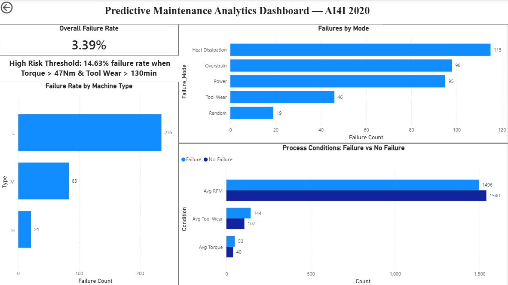

# Predictive Maintenance Analysis — AI4I 2020

## Project Overview
This project analyzes manufacturing machine failure patterns using SQL and Power BI. 
The goal is to identify process conditions that predict machine failure, enabling 
proactive maintenance decisions that reduce unplanned downtime on the production floor.

## Business Problem
Unplanned machine failures in manufacturing cause production stoppages, downstream 
delays, and significant costs. This analysis identifies which machines, failure modes, 
and process conditions are highest risk — allowing Industrial Engineering teams to intervene before failure 
occurs rather than reacting after.

## Tools Used
- **Microsoft SQL Server** — data loading, querying, and analysis
- **Power BI Desktop** — interactive dashboard and visualization

## Dataset
- 10,000 production run records from a synthetic milling process
- 14 features including machine type, air temperature, process temperature, 
  rotational speed, torque, tool wear, and failure mode flags

## Key Findings

### 1. Overall Failure Rate
- 339 failures out of 10,000 production runs
- Overall failure rate: **3.39%**

### 2. Failure Rate by Machine Type
| Machine Type | Total Runs | Failures | Failure Rate |
|---|---|---|---|
| L (Low) | 6,000 | 235 | 3.92% |
| M (Medium) | 2,997 | 83 | 2.77% |
| H (High) | 1,003 | 21 | 2.09% |

Low grade machines fail most frequently despite being used most often.

### 3. Failure Mode Breakdown
| Failure Mode | Count |
|---|---|
| Heat Dissipation | 115 |
| Overstrain | 98 |
| Power | 95 |
| Tool Wear | 46 |
| Random | 19 |

Heat dissipation is the dominant failure mode at 34% of all failures — and preventable 
through real-time temperature monitoring.

### 4. Process Conditions: Failure vs No Failure
| Condition | No Failure | Failure | Difference |
|---|---|---|---|
| Avg Torque (Nm) | 39.63 | 50.17 | +27% |
| Avg Tool Wear (min) | 106.69 | 143.78 | +35% |
| Avg RPM | 1,540 | 1,496 | -3% |

Machines that fail run at significantly higher torque and tool wear levels.

### 5. High Risk Threshold Alert
Machines running with **Torque > 47Nm AND Tool Wear > 130 minutes** show a failure 
rate of **14.63%** — 4.3x higher than the overall average.

This threshold can be implemented as a real-time SQL alert to flag at-risk machines 
before failure occurs — no machine learning required.

## Dashboard

## Recommendation
Monitor torque and tool wear in real time. When both exceed threshold values 
simultaneously, flag the machine for inspection before the next production run. 
This simple rule targets the highest-risk 9.5% of production runs responsible for 
41% of all failures.

## Dataset Citation
S. Matzka, "Explainable Artificial Intelligence for Predictive Maintenance 
Applications," 2020 Third International Conference on Artificial Intelligence 
for Industries (AI4I), 2020, pp. 69-74, 
doi: 10.1109/AI4I49448.2020.00023.

Milling process image credit: Daniel Smyth @ Pexels
https://www.pexels.com/de-de/foto/industrie-herstellung-maschine-werkzeug-10406128/

## Author
**Raj Shethna**
[LinkedIn](https://linkedin.com/in/rajshethna) | [Portfolio](https://rajshethna.github.io)
